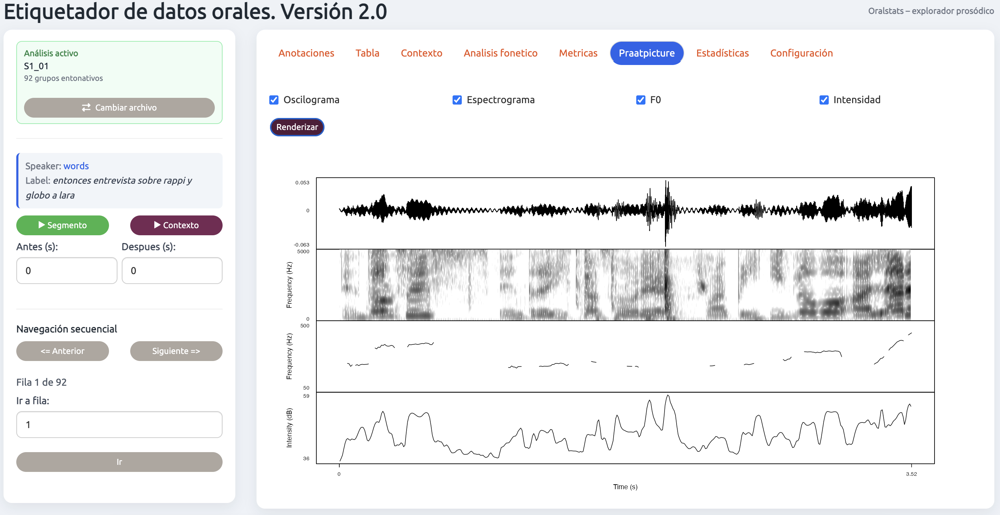
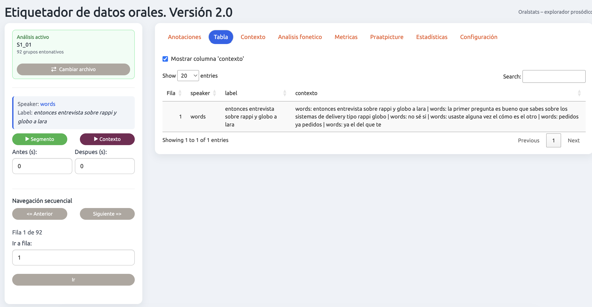

# Oraltags. Oral data tagger — v2.0

**🌐 Language / Idioma:** **English** · [Español](README_ES.md)

> *Oraltags — a prosody explorer for oral data*

An R/Shiny application for the linguistic annotation and acoustic analysis of oral corpora. It lets you load audio and a transcription, navigate intonation group by intonation group, automatically compute prosodic metrics, annotate with fully configurable categories, and explore the results with tables, Praat-style figures and statistical charts.


---

## What's new in v2.0

- **Annotation-variable editor**: every category (labels and possible values) is now configurable from the interface itself, without touching the code.
- **New *Emotions* tab** with Ekman emotional tone and intensity.
- **\*Metrics\* tab** with a complete textual prosodic report of the active row.
- **\*Praatpicture\* tab** for rendering multi-panel, Praat-style figures.
- **\*Statistics\* tab** with bar charts and box plots over the annotations.
- Side panel with **sequential navigation**, segment playback and adjustable preceding/following context.

---

## Main features

The app is organised into six top-level tabs:

| Tab | Function |
|---|---|
| **Annotations** | Tagging form divided into five thematic blocks (see below). |
| **Context** | Rows before/after the selection; lets you **edit the speaker/label of the active row** (saved to the analysis) and show an **`ejemplo_para_paper`** column with a `(corpus, start-end)` citation. |
| **Phonetic analysis** | Subtabs **Images** (oscillogram, spectrogram, F0), **Metrics** (prosodic report) and **Praatpicture** (multi-panel figure). |
| **Statistics** | Subtabs **This file** (bars/boxplots of the loaded corpus) and **Full corpus** (global overview of `analisis_todos.txt`). |
| **Agreement** | Agreement between 2–10 judges (analysis files from other teams): percentage agreement, Cohen's Kappa (weighted for ordinals), Fleiss' Kappa and Krippendorff's α (optional). |
| **Settings** | Annotation-variable editor: customise labels and categories. |

### Material loading and navigation

- **Material loading**: audio in WAV, MP3 or MP4 + transcription in CSV, TXT or TextGrid (Praat). Automatic MP3/MP4 to WAV conversion for analysis.
- **Sequential navigation**: ⬅ Previous / Next ➡ buttons, direct jump to any row and a position indicator (`Row X of N`).
- **Playback**: of the isolated segment or with preceding/following context, by adjusting the *Before (s)* and *After (s)* seconds.
- **Preloaded pairs**: place audio + transcription with the same base name in `www/audios/` and the app detects them automatically.

### Automatic per-segment acoustic analysis

Metrics are recomputed automatically when you change row:

- Mean and median F0 (Hz), with `wrassp::ksvF0`
- F0 standard deviation and range (in semitones / p10–p90)
- Global pitch movement and final toneme (last 20 %), with its melodic pattern
- Mean intensity (dB)
- Speech rate (words/s and phonemes/s) and preceding/following pauses




### Annotation

The **Annotations** form is divided into five blocks. The categories shown are the defaults, but they can be fully modified from **Settings**:

| Block | Example categories |
|---|---|
| **Structure** | Utterance type, sentence modality, information status, syntactic complexity, reformulation / expansion, global discourse function, reference to others' discourse, temporality of the content |
| **Pragmatics** | Pragmatic function, interpersonal function, mitigation, intensification, politeness, other's face, self-image |
| **Discourse and interaction** | Conversational move, turn management, relation to the previous turn, interactive dynamics, discourse marker, phatic function, deixis, colloquial resources |
| **Paralinguistic / non-verbal** | Non-verbal sounds, non-verbal overlaps, articulatory noise, breathing phenomena, non-verbal turns, ambient noise, vocal attitude |
| **Emotions** | Ekman emotional tone (Neutral, Joy, Sadness, Fear, Anger, Disgust, Surprise, Contempt) and intensity (1–5) |


### Tables and context




### Statistics


### Settings (variable editor)

Each annotation variable (`anot1`, `anot2`, …) has an editable label and its list of categories (one per line). This way, the same tagger works for different annotation schemes without any reprogramming.


### Persistence and export

- **Automatic saving**: as you navigate or annotate, data is persisted to a TSV (`analisis_<name>.txt`) and to a consolidated file (`analisis_todos.txt`).
- **Backup system**: a timestamped backup is created in `backup/` when data is loaded.
- **Export**: CSV, TXT and direct dump to Google Sheets.

### Export and customisation (v2.1)

- **High-quality chart download** (PNG 300 dpi and vector PDF) for the *Statistics*, *Agreement* and *Corpus* charts.
- **Table export** to CSV, Excel and clipboard (buttons embedded in each table; they export all rows).
- **Chart font size** adjustable with a global slider in *Settings*.
- **Encouraging message** shown optionally at startup (random phrase or your own), enabled in *Settings*.
- **Interface language**: a **Spanish / English** selector in the header (hot switching; remembers your choice). The annotation scheme stays in Spanish.

---

## Requirements

- R ≥ 4.1
- R packages:

```r
install.packages(c(
  "shiny", "DT", "tuneR", "shinyjs", "shinythemes",
  "seewave", "wrassp", "praatpicture", "tools", "av", "rPraat", "shiny.i18n"
))
```

> `rPraat` is only needed to read Praat TextGrid files; `praatpicture` only for the *Praatpicture* tab.
> `irr` is optional: it enables Krippendorff's α in the *Agreement* tab. Without it, that column shows as N/A.
> `ffmpeg` is optional (an external binary, not an R package): if it is on the `PATH`, when an MP4 is loaded the sidebar viewer cuts and plays the exact clip of each intonation group. Without it the app still works, but the segment video uses the full file (approximate synchronisation). Audio and the rest of the analysis do not need it.

---

## Installation and use

```r
# Clone the repository and move into the folder
setwd("path/to/etiquetador_oral")

# Launch the application
shiny::runApp("etiquetador.R")
```

### File organisation

```
etiquetador_oral/
├── etiquetador.R            # Main app code
├── imgs/                    # Example screenshots (this README)
├── www/
│   └── audios/              # Preloaded pairs (same base name)
│       ├── entrevista1.mp3
│       └── entrevista1.csv
├── backup/                  # Automatic backups (created when data is loaded)
├── analisis_<name>.txt      # Per-corpus analysis (generated automatically)
└── analisis_todos.txt       # Consolidated file for all corpora (generated automatically)
```

### Transcription format (CSV / TXT)

The transcription must include at least these columns:

| Column | Description |
|---|---|
| `speaker` | Speaker identifier |
| `start` | Start time in seconds |
| `end` | End time in seconds |
| `label` | Transcription of the segment |

---

## Workflow

1. Load the audio and the transcription (**Preloaded** or **Load** tab).
2. Navigate with **⬅ Previous / Next ➡** or jump directly to a row.
3. Listen to the segment with **▶ Segment** or with adjustable preceding/following context.
4. Acoustic metrics are computed automatically when you change row (*Phonetic analysis* and *Metrics* tabs).
5. Fill in the annotations in the **Annotations** blocks and click **Save**.
6. If needed, adjust the label scheme in **Settings**.
7. Explore the results in **Statistics** and export as CSV, TXT or Google Sheets.

---

## License

© 2025 Adrián Cabedo Nebot.  
Distributed under the **GNU General Public License v3.0 (GPL-3.0)**.  
Use, distribution and modification are permitted under the terms of the GPL-3.0.  
[See the full license text](LICENSE)
