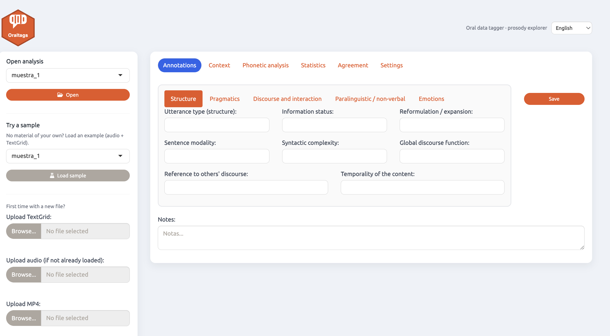
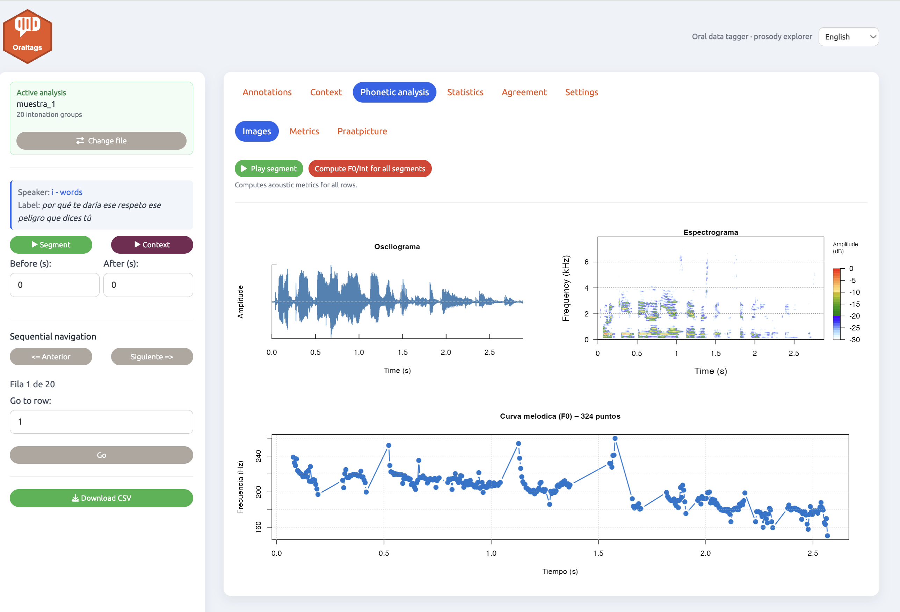
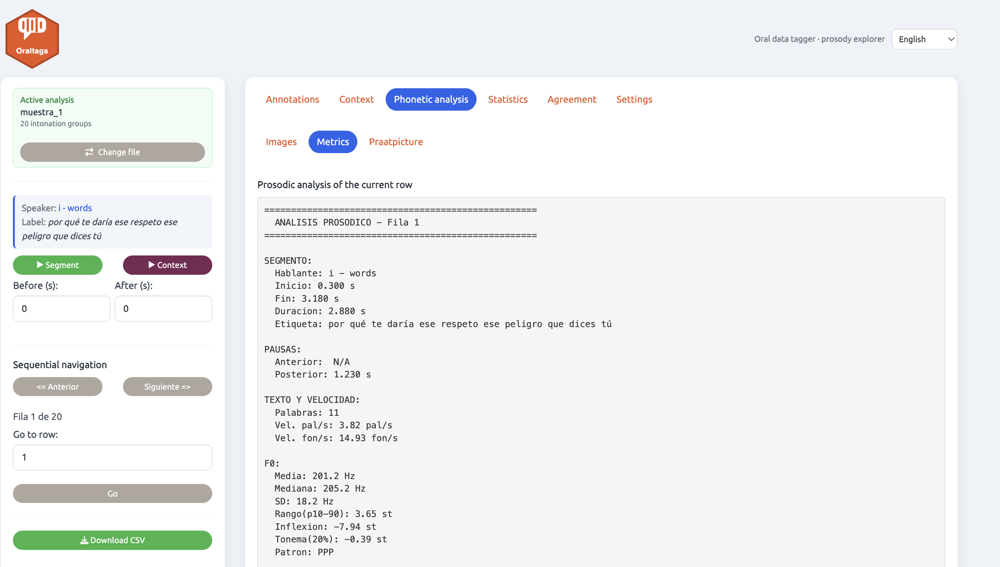
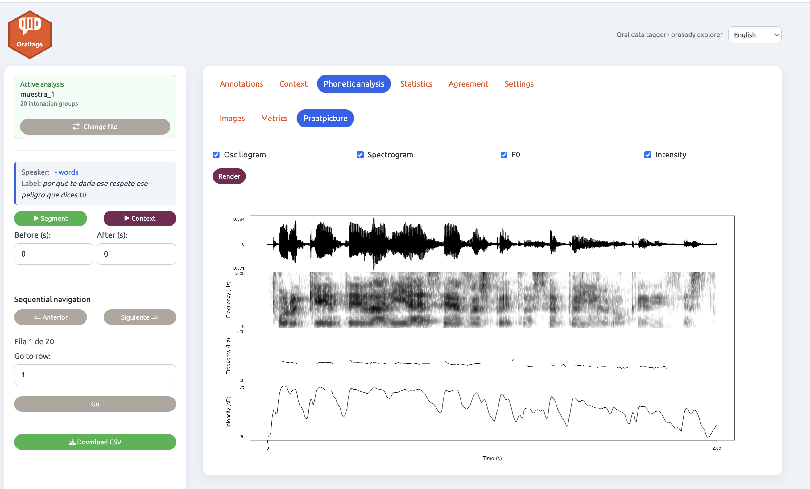
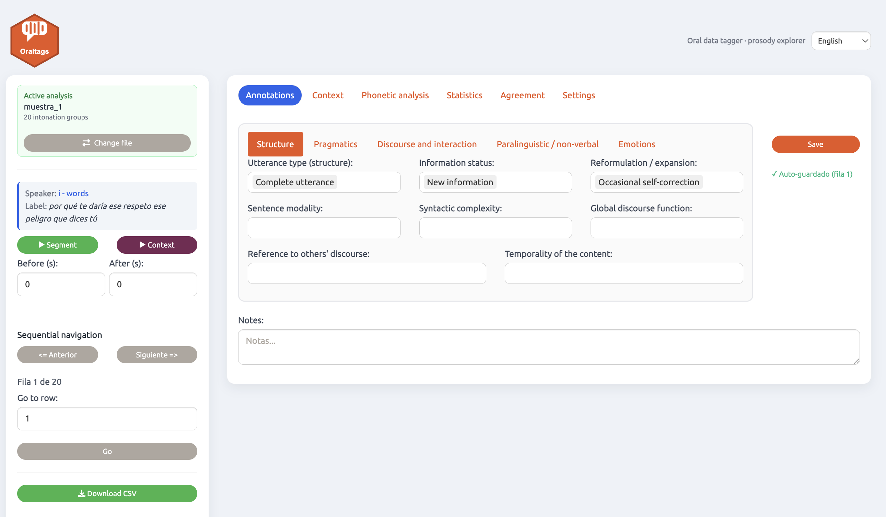
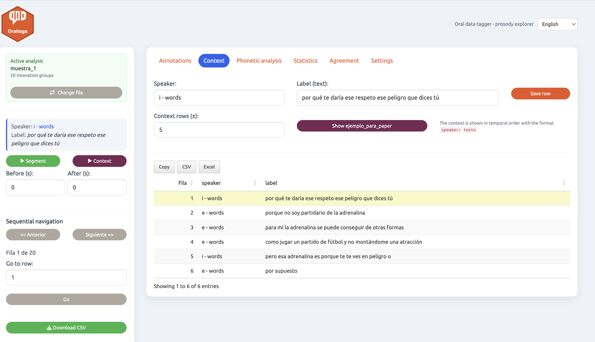
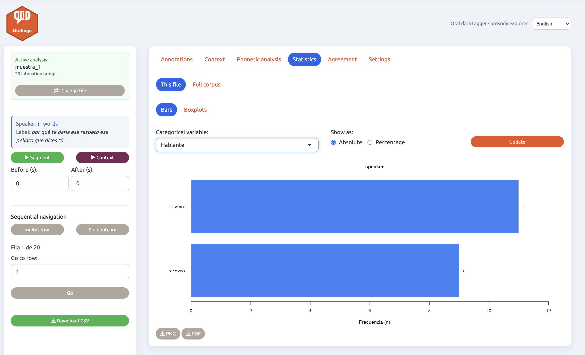
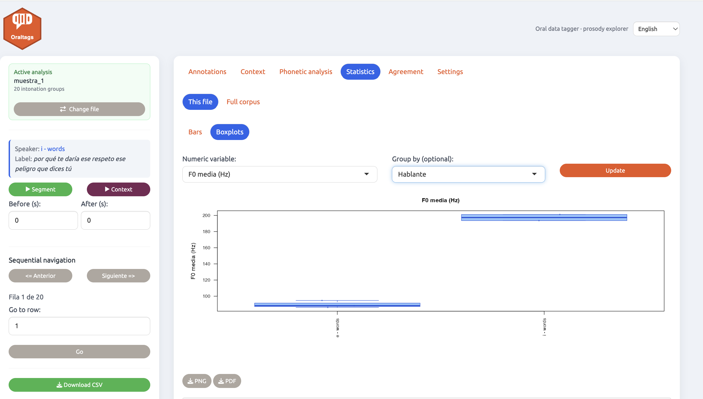
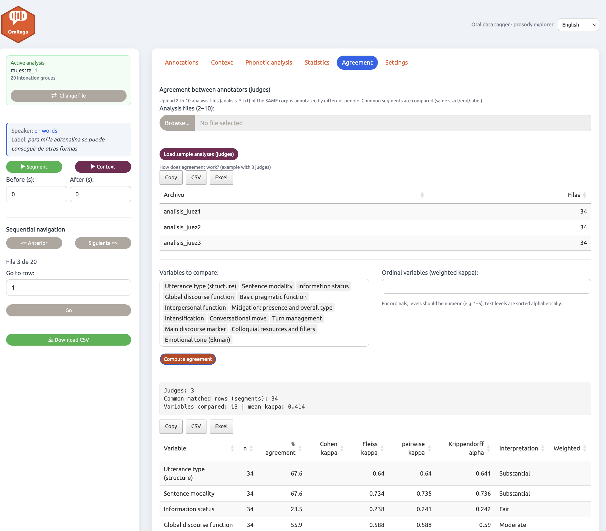
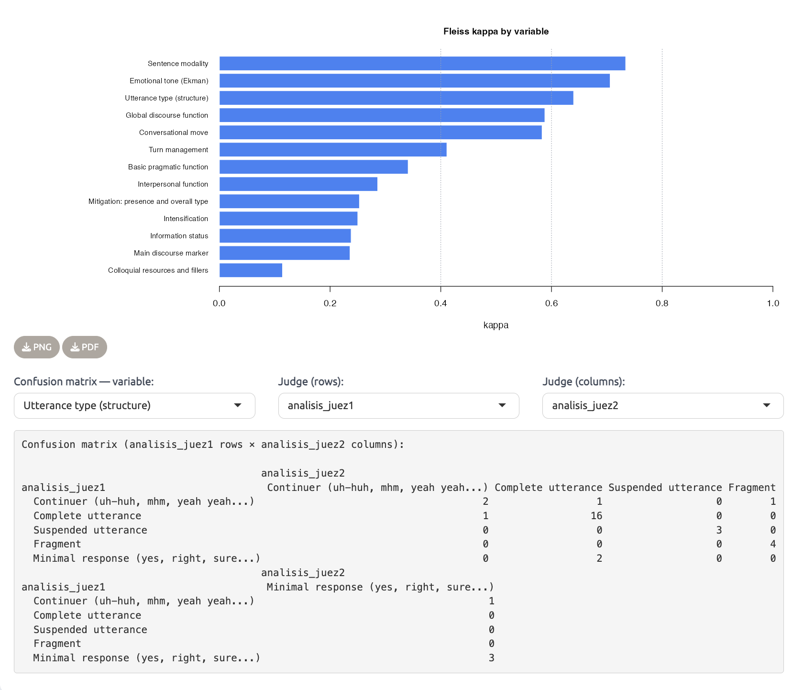

# Oraltags. Oral data tagger — v2.2

**🌐 Language / Idioma:** 🇬🇧 **English** · [🇪🇸 Español](README_ES.md)

> *Oraltags — a prosody explorer for oral data*

An R/Shiny application for the linguistic annotation and acoustic analysis of oral corpora. It lets you load audio and a transcription, navigate intonation group by intonation group, automatically compute prosodic metrics, annotate with fully configurable categories, and explore the results with tables, Praat-style figures and statistical charts.

> **⚡ Quick install (recommended):** in R, run
> `remotes::install_github("acabedo/oraltags", subdir = "package")`
> and then `oraltags::run_app()`. Dependencies install automatically and three audio + TextGrid samples are bundled so you can try it right away. Full details in [Installation and use](#installation-and-use).

> **📖 Full documentation:** the detailed user guide (every operation in the app, all annotated and computed variables, input/output files and the R code of the package) is published at **<https://acabedo.github.io/oraltags/>** (built with pkgdown from the sources in [`package/vignettes/`](package/vignettes/) into [`docs/`](docs/)).



---

## What's new in v2.0

- **Annotation-variable editor**: every category (labels and possible values) is now configurable from the interface itself, without touching the code.
- **New *Emotions* tab** with Ekman emotional tone and intensity.
- **\*Metrics\* tab** with a complete textual prosodic report of the active row.
- **\*Praatpicture\* tab** for rendering multi-panel, Praat-style figures.
- **\*Statistics\* tab** with bar charts and box plots over the annotations.
- Side panel with **sequential navigation**, segment playback and adjustable preceding/following context.

---

## Main features

The app is organised into six top-level tabs:

| Tab | Function |
|---|---|
| **Annotations** | Tagging form divided into five thematic blocks (see below). |
| **Context** | Rows before/after the selection; lets you **edit the speaker/label of the active row** (saved to the analysis) and show an **`ejemplo_para_paper`** column with a `(corpus, start-end)` citation. |
| **Phonetic analysis** | Subtabs **Images** (oscillogram, spectrogram, F0), **Metrics** (prosodic report) and **Praatpicture** (multi-panel figure). |
| **Statistics** | Subtabs **This file** (bars/boxplots of the loaded corpus) and **Full corpus** (global overview of `analisis_todos.txt`). |
| **Agreement** | Agreement between 2–10 judges (analysis files from other teams): percentage agreement, Cohen's Kappa (weighted for ordinals), Fleiss' Kappa and Krippendorff's α (optional). |
| **Settings** | Annotation-variable editor (customise labels and categories), chart preferences and **saved-analyses manager** (delete previous analyses). |

### Material loading and navigation

- **Material loading**: audio in WAV, MP3 or MP4 + transcription in CSV, TXT or TextGrid (Praat). Automatic MP3/MP4 to WAV conversion for analysis.
- **Sequential navigation**: ⬅ Previous / Next ➡ buttons, direct jump to any row and a position indicator (`Row X of N`).
- **Playback**: of the isolated segment or with preceding/following context, by adjusting the *Before (s)* and *After (s)* seconds.
- **Preloaded pairs**: place audio + transcription with the same base name in `www/audios/` and the app detects them automatically.

### Automatic per-segment acoustic analysis

Metrics are recomputed automatically when you change row:

- Mean and median F0 (Hz), with `wrassp::ksvF0`
- F0 standard deviation and range (in semitones / p10–p90)
- Global pitch movement and final toneme (last 20 %), with its melodic pattern
- Mean intensity (dB)
- Speech rate (words/s and phonemes/s) and preceding/following pauses







### Annotation

The **Annotations** form is divided into five blocks. The categories shown are the defaults, but they can be fully modified from **Settings**:

| Block | Example categories |
|---|---|
| **Structure** | Utterance type, sentence modality, information status, syntactic complexity, reformulation / expansion, global discourse function, reference to others' discourse, temporality of the content |
| **Pragmatics** | Pragmatic function, interpersonal function, mitigation, intensification, politeness, other's face, self-image |
| **Discourse and interaction** | Conversational move, turn management, relation to the previous turn, interactive dynamics, discourse marker, phatic function, deixis, colloquial resources |
| **Paralinguistic / non-verbal** | Non-verbal sounds, non-verbal overlaps, articulatory noise, breathing phenomena, non-verbal turns, ambient noise, vocal attitude |
| **Emotions** | Ekman emotional tone (Neutral, Joy, Sadness, Fear, Anger, Disgust, Surprise, Contempt) and intensity (1–5) |



### Context

The **Context** tab shows the rows before/after the active segment (highlighted), lets you edit the speaker/label of the active row and can add an `ejemplo_para_paper` column with a `(corpus, start-end)` citation.



### Statistics





In **Statistics → Full corpus** you can now **choose which files** of the consolidated corpus (`analisis_todos.txt`) are included: a multi-select lists every file and all tables and charts are recomputed with your selection (all files are included by default).

### Agreement between judges

Upload 2–10 `analisis_*.txt` files from annotators of the same corpus (or load the bundled 3-judge sample): the app matches the common segments and computes % agreement, Cohen's/Fleiss' kappa, pairwise kappa and Krippendorff's α per variable, plus a kappa chart and pairwise confusion matrices.





### Settings (variable editor and analysis management)

Each annotation variable (`anot1`, `anot2`, …) has an editable label and its list of categories (one per line). This way, the same tagger works for different annotation schemes without any reprogramming.

**Settings** also includes a **saved-analyses manager**: select one or more previous analyses (`analisis_*.txt`) and delete them — a timestamped copy is stored in `backup/` first, their rows are removed from the consolidated `analisis_todos.txt`, and you can optionally delete the associated audio.

### Persistence and export

- **Automatic saving**: as you navigate or annotate, data is persisted to a TSV (`analisis_<name>.txt`) and to a consolidated file (`analisis_todos.txt`).
- **Backup system**: a timestamped backup is created in `backup/` when data is loaded.
- **Export**: CSV, TXT and direct dump to Google Sheets.

### Export and customisation (v2.1)

- **High-quality chart download** (PNG 300 dpi and vector PDF) for the *Statistics*, *Agreement* and *Corpus* charts.
- **Table export** to CSV, Excel and clipboard (buttons embedded in each table; they export all rows).
- **Chart font size** adjustable with a global slider in *Settings*.
- **Encouraging message** shown optionally at startup (random phrase or your own), enabled in *Settings*.
- **Interface language**: a **Spanish / English** selector in the header (hot switching; remembers your choice). The annotation scheme stays in Spanish.

### New in v2.2

- **Saved-analyses manager** (*Settings*): delete previous analyses with confirmation, automatic backup, cleanup of the consolidated file and optional deletion of the associated audio.
- **File selection in *Full corpus* statistics**: choose which files of `analisis_todos.txt` enter the tables and charts.
- **Documentation site** built with pkgdown at <https://acabedo.github.io/oraltags/> (sources in `package/vignettes/`, output in `docs/`).

---

## Requirements

- R ≥ 4.1
- R packages — **if you install with Option A below (`install_github`) these are pulled in automatically**, so you can skip this step. You only need to install them by hand if you run the app from source (Option B):

```r
install.packages(c(
  "shiny", "DT", "tuneR", "shinyjs", "shinythemes",
  "seewave", "wrassp", "praatpicture", "tools", "av", "rPraat", "shiny.i18n"
))
```

> `rPraat` is only needed to read Praat TextGrid files; `praatpicture` (by [Rasmus Puggaard-Rode](https://github.com/rpuggaardrode/praatpicture)) only for the *Praatpicture* tab.
> `irr` is optional: it enables Krippendorff's α in the *Agreement* tab. Without it, that column shows as N/A.
> `ffmpeg` is optional (an external binary, not an R package): if it is on the `PATH`, when an MP4 is loaded the sidebar viewer cuts and plays the exact clip of each intonation group. Without it the app still works, but the segment video uses the full file (approximate synchronisation). Audio and the rest of the analysis do not need it.

---

## Installation and use

### Option A — Install as an R package (recommended)

The easiest way. Install straight from GitHub; all the required R packages are pulled in automatically:

```r
# install.packages("remotes")   # if you don't have it yet
remotes::install_github("acabedo/oraltags", subdir = "package")

# Launch the application
oraltags::run_app()
```

No need to clone the repository or set a working directory. Your data — saved analyses, backups, preferences and the audio you load — is stored in a standard per-user folder (`tools::R_user_dir("oraltags", "data")`), so nothing is ever written inside the installed package.

**Try it with the bundled samples:** the package ships **three audio + TextGrid examples**. In the app's file sidebar, pick one under **"Load sample"** and click the button — you can explore every feature without providing your own material.

> Optional: install `ffmpeg` (an external binary, not an R package) for exact per-segment video clipping with MP4s. The app works fine without it — see *Requirements*.

### Option B — Run from source (clone)

If you prefer to work with the script directly, clone the repository and, from R inside the repo folder:

```r
# Install the R packages first (see Requirements), then:
source("etiquetador_oral.R")   # or open it in RStudio and click "Run App"
```

In this mode the working folders (`config/`, `analisis/`, `backup/`, `www/audios/`) live inside the repository.

### File organisation (source version)

```
oraltags/
├── etiquetador_oral.R       # Main app code (single-file Shiny app)
├── package/                 # Installable R package (Option A): oraltags::run_app()
├── R/                       # Pure helper functions
├── docs/                    # Documentation site (pkgdown; GitHub Pages)
├── imgs/                    # Example screenshots (this README)
├── samples/                 # Example audio + TextGrid pairs
├── www/
│   └── audios/              # Preloaded pairs (same base name)
├── config/                  # Custom label scheme and preferences
├── backup/                  # Automatic backups (created when data is loaded)
└── analisis/                # Per-corpus analyses + consolidated analisis_todos.txt
```

### Transcription format (CSV / TXT)

The transcription must include at least these columns:

| Column | Description |
|---|---|
| `speaker` | Speaker identifier |
| `start` | Start time in seconds |
| `end` | End time in seconds |
| `label` | Transcription of the segment |

---

## Workflow

1. Load the audio and the transcription (**Preloaded** or **Load** tab).
2. Navigate with **⬅ Previous / Next ➡** or jump directly to a row.
3. Listen to the segment with **▶ Segment** or with adjustable preceding/following context.
4. Acoustic metrics are computed automatically when you change row (*Phonetic analysis* and *Metrics* tabs).
5. Fill in the annotations in the **Annotations** blocks and click **Save**.
6. If needed, adjust the label scheme in **Settings**.
7. Explore the results in **Statistics** and export as CSV, TXT or Google Sheets.

---

## Acknowledgements

- The *Praatpicture* tab is powered by the [praatpicture](https://github.com/rpuggaardrode/praatpicture) package by **Rasmus Puggaard-Rode**.
- **AI assistance**: the R package infrastructure and parts of the application code and documentation were developed with the assistance of generative AI (Anthropic's Claude), under the design, supervision and review of the author.

## How to cite

> Cabedo-Nebot, A. (2026). *Oraltags: oral data tagger and prosody explorer*. R package version 2.2.0. <https://github.com/acabedo/oraltags>

In R: `citation("oraltags")`. See also [`CITATION.cff`](CITATION.cff).

## License

© 2025 Adrián Cabedo Nebot.  
Distributed under the **GNU General Public License v3.0 (GPL-3.0)**.  
Use, distribution and modification are permitted under the terms of the GPL-3.0.  
[See the full license text](LICENSE)
